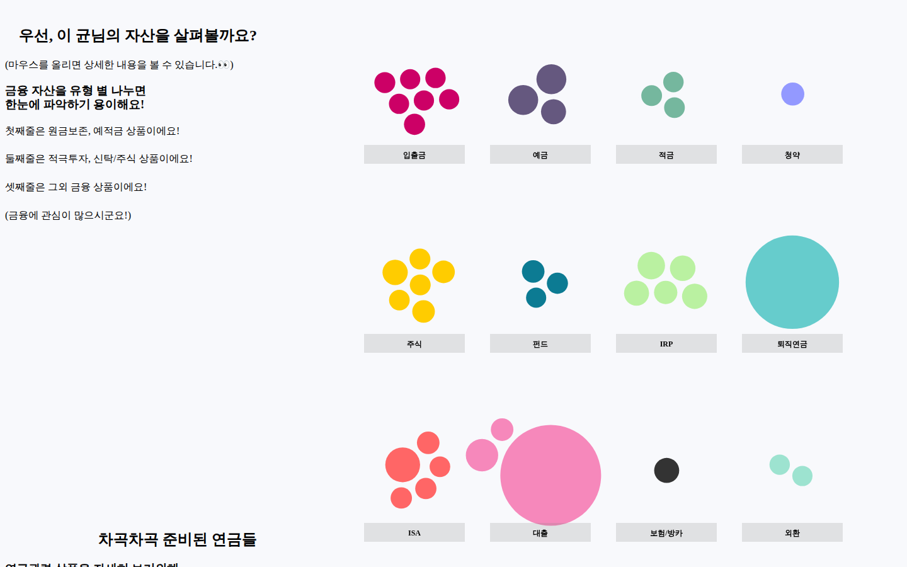

# ScrollyTelling POC — 마이데이터 은퇴설계 리포트

D3.js로 만든 **스크롤 연동형 데이터 시각화(Scrollytelling)** POC입니다.
사용자가 페이지를 스크롤하면 왼쪽의 스토리 텍스트에 맞춰 오른쪽 차트가 애니메이션으로 전환되며,
마이데이터로 모은 가상 고객 "이 균"님의 금융자산을 분석해 **맞춤형 은퇴준비 리포트([똑똑한 은퇴준비편])** 를 보여줍니다.

- 🔗 **데모**: https://arnorfati.github.io/data-visualisation-with-d3/
- 📚 **원본 튜토리얼**: [How I Created an Interactive, Scrolling Visualisation with D3.js](https://towardsdatascience.com/how-i-created-an-interactive-scrolling-visualisation-with-d3-js-and-how-you-can-too-e116372e2c73)
  ([cuthchow/college-majors-visualisation](https://github.com/cuthchow/college-majors-visualisation))
- 원본은 미국 대학 전공별 연봉·성비를 다루는 시각화이며, 이 저장소는 이를 포크해 **자산관리 서비스(내자산연구소)** 콘셉트에 맞게 커스터마이징했습니다.
  초기 버전은 "슬기로운 지출생활" 콘셉트였고, 현재 버전은 "은퇴준비" 리포트입니다.



---

## 스토리 구성

`index.html`의 각 `<section class="step">`이 하나의 장면이며, 스크롤로 해당 섹션이 활성화되면
`sections.js`의 `activationFunctions` 배열에서 같은 순서의 함수가 실행됩니다.

| # | 섹션 내용 | 실행 함수 | 시각화 |
|---|-----------|-----------|--------|
| 1 | 인트로 — 55세 남성 평균 금융자산·노후 생활비 소개 | `draw8` | 전체 자산 버블이 화면 중앙에 모이는 Force 레이아웃 |
| 2 | 자산 살펴보기 — 유형별 금융자산 | `draw3` | 자산 유형(주식·ISA·예금·IRP 등)별 그리드로 버블 분리, 라벨에 마우스를 올리면 유형별 총 자산 표시 |
| 3 | 차곡차곡 준비된 연금들 | `draw6` | 산점도: X축 투자성향(적극투자 ↔ 안정추구), Y축 기간(단기성 ↔ 장기성), 자산 유형별 색상 + 범례 |
| 4 | 준비가 잘된 부분 | `draw6_1` | 같은 산점도를 수익률 기준 색상(초록=수익, 빨강=손실)으로 재채색 |
| 5 | 준비가 필요한 부분 — 유동성 자산 부족 | `draw7` | 단기성 ↔ 장기성 한 축 위에 버블 정렬 |
| 6 | 알뜰하게 연금 개시하기 — 연 1,500만 원 기준 | `draw4` | 나이(55세~)별 연간 연금 수령액 도트 차트, 1,500만 원 초과 구간 강조 |
| 7 | 마지막으로 — 하나 더 넥스트 안내 | `draw9` | 버블을 미리 계산된 좌표(`list_x`, `list_y`)로 재배치해 로고 형태 구성 |

모든 원(circle)에 마우스를 올리면 툴팁으로 **자산 유형 · 상품명 · 자산 금액 · 수익률 · 금융기관**이 표시됩니다.

## 기술 스택

- **D3.js v5.15.0** (`d3.js`, 로컬 번들) — force simulation, scale, axis, transition
- **[d3-legend](https://d3-legend.susielu.com/) 2.25.6** (CDN) — 색상/크기 범례
- 순수 HTML / CSS / JavaScript (빌드 과정 없음)

## 동작 원리

1. **`scroller.js`** — 각 `.step` 섹션의 세로 위치를 계산하고, 스크롤 위치에 따라 현재 활성 섹션 인덱스를
   `d3.dispatch`의 `active` / `progress` 이벤트로 내보냅니다.
2. **`sections.js`**
   - `d3.csv('data/recent-grads.csv')`로 데이터를 읽고 `createScales()`에서 스케일을 생성합니다.
   - `drawInitial()`에서 SVG, 원, 축, 라벨 등 모든 요소를 한 번에 만들어 두고(대부분 `opacity: 0`),
   - 각 `drawN()` 함수가 `clean()`으로 불필요한 요소를 숨긴 뒤 원의 위치·크기·색상을 transition으로 바꿉니다.
   - 스크롤로 여러 섹션을 건너뛰어도 중간 단계 함수가 순서대로 실행되도록 `lastIndex` ~ `activeIndex` 범위를 모두 호출합니다.

## 디렉터리 구조

```
.
├── index.html            # 메인 페이지 (은퇴준비 리포트 스토리 텍스트)
├── sections.js           # 데이터 로드, 스케일, drawN() 시각화 단계 정의
├── scroller.js           # 스크롤 위치 → 활성 섹션 이벤트 디스패처
├── style2.css            # 메인 페이지 스타일
├── d3.js                 # D3 v5.15.0 번들
├── data/
│   ├── recent-grads.csv  # ★ 시각화에 사용하는 자산 데이터 (125개 금융상품)
│   └── ...               # 원본 프로젝트의 FiveThirtyEight College Majors 데이터
├── images/               # 로고 및 섹션 내 안내 이미지
├── preview.png           # 미리보기 이미지
│
├── sections2.js          # (미사용) 이전 "슬기로운 지출생활" 버전 시각화 코드
├── style.css             # (미사용) 원본/이전 버전 스타일
├── index4.html           # (별도) 카드 소비 카테고리 LDA 토픽 모델 시각화 (pyLDAvis)
├── Pics/                 # 원본 프로젝트의 스케치·GIF·영상 자료
└── Data Processing/      # 원본 프로젝트의 데이터 탐색용 Jupyter 노트북
```

## 데이터 (`data/recent-grads.csv`)

원본 프로젝트의 CSV 파일명과 일부 컬럼명을 그대로 유지한 채, 값을 **가상의 자산 데이터**로 교체해 사용합니다.
따라서 컬럼 이름과 실제 의미가 다를 수 있습니다.

| 컬럼 | 코드 내 필드 | 의미 |
|------|--------------|------|
| `Major_category` | `Category` | 자산 유형 (주식, ISA, 입출금, 펀드, 대출, 예금, IRP, 보험/방카, 적금, 퇴직연금, 외환, 청약, 기타) |
| `Major` | `Major` | 상품명 |
| `fin_type` | `fin_type` | 금융기관 |
| `asset_size` | `asset_size` | 자산 금액(원) — 자산 유형 그리드의 원 크기 |
| `asset_size_part2` | `asset_size_part2` | 산점도·버블 차트의 원 크기 |
| `ShareWomen` | `ShareWomen` | 수익률 (툴팁, 수익률 색상 구분) |
| `x1` | `x1` | 투자성향 (0 = 적극투자 → 1 = 안정추구) |
| `x2` | `x2` | 기간 (0 = 단기성 → 1 = 장기성) |
| `Median` | `Median` | 인트로 버블 크기 |
| `midpoint` | `Midpoint` | 연금 개시 차트의 나이(X축) |
| `Histogram_column` | `HistCol` | 연금 개시 차트의 연간 수령액(Y축) |
| `color_hist` | `color_hist` | 연금 개시 차트의 점 색상 |
| `list_x`, `list_y`, `logo_color` | 동일 | 마지막 섹션의 로고 배치 좌표와 색상 |

> `data/` 폴더의 나머지 파일(`all-ages.csv`, `grad-students.csv`, `majors-list.csv`, `women-stem.csv`, `college-majors-rscript.R`)은
> 원본 프로젝트의 [FiveThirtyEight College Majors](https://github.com/fivethirtyeight/data/tree/master/college-majors) 데이터이며, 현재 시각화에서는 사용하지 않습니다. 자세한 내용은 [`data/readme.md`](data/readme.md)를 참고하세요.

## 로컬 실행

`d3.csv()`로 CSV를 불러오므로 `file://`로 직접 열면 브라우저 보안 정책(CORS) 때문에 데이터가 로드되지 않습니다.
반드시 로컬 웹 서버로 실행하세요.

```bash
# 방법 1: Python
python3 -m http.server 5501
# → http://localhost:5501 접속

# 방법 2: VS Code Live Server 확장 (포트 5501로 설정되어 있음, .vscode/settings.json)
```

## 커스터마이징 가이드

- **스토리 텍스트 수정**: `index.html`의 `<section class="step">` 내용을 편집합니다.
- **자산 데이터 교체**: `data/recent-grads.csv`의 값을 교체합니다. 위 데이터 표의 컬럼 의미를 참고하세요.
- **자산 유형·색상 변경**: `sections.js` 상단의 `categories`, `colors`, `categoriesXY`(그리드 위치, 유형별 총 자산 라벨)를 수정합니다.
- **섹션 추가/순서 변경**: `index.html`에 섹션을 추가하고, `sections.js`의 `activationFunctions` 배열에 같은 순서로 draw 함수를 등록합니다.
  섹션 수와 배열 길이가 반드시 일치해야 합니다.

## 크레딧

- 원본 시각화 및 튜토리얼: [Cuthbert Chow](https://github.com/cuthchow/college-majors-visualisation)
- 원본 데이터: [FiveThirtyEight — The Economic Guide To Picking A College Major](https://fivethirtyeight.com/features/the-economic-guide-to-picking-a-college-major/)
- 은퇴준비 리포트 콘텐츠: 이노베이터 HA:P조
- 본 저장소의 자산 데이터와 고객 정보는 POC용 **가상 데이터**입니다.
